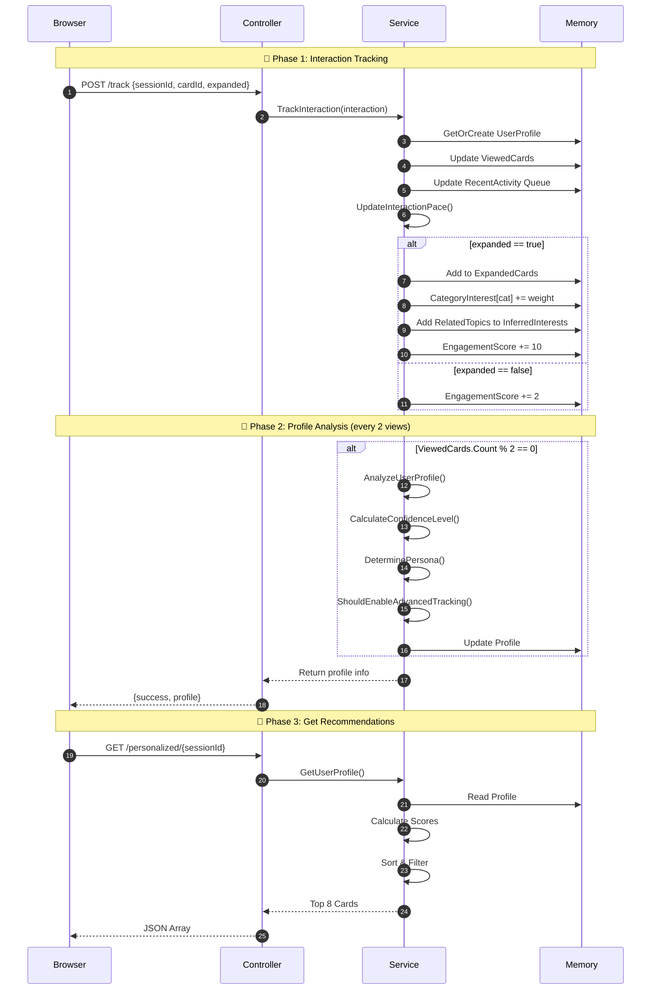

# 🏗️ البنية العامة - Architecture

## 1. مخطط المكونات

```
┌─────────────────────────────────────────────────────────────────────────────┐
│                              CLIENT LAYER                                   │
├─────────────────────────────────────────────────────────────────────────────┤
│                                                                             │
│   ┌─────────────────┐    ┌─────────────────┐    ┌─────────────────┐        │
│   │  Index.cshtml   │    │  JavaScript     │    │  SignalR Hub    │        │
│   │  (Razor Page)   │───▶│  Tracking       │───▶│  (Real-time)    │        │
│   └─────────────────┘    └─────────────────┘    └─────────────────┘        │
│                                                                             │
└─────────────────────────────────────────────────────────────────────────────┘
                                    │
                                    │ HTTP POST / WebSocket
                                    ▼
┌─────────────────────────────────────────────────────────────────────────────┐
│                              API LAYER                                       │
├─────────────────────────────────────────────────────────────────────────────┤
│                                                                             │
│   ┌───────────────────────────────────────────────────────────────┐        │
│   │                  CapabilitiesController.cs                     │        │
│   ├───────────────────────────────────────────────────────────────┤        │
│   │  POST /api/capabilities/track                                  │        │
│   │  GET  /api/capabilities/personalized/{sessionId}               │        │
│   │  GET  /api/capabilities/all                                    │        │
│   │  GET  /api/capabilities/initial                                │        │
│   │  GET  /api/capabilities/{id}/related                           │        │
│   └───────────────────────────────────────────────────────────────┘        │
│                                                                             │
└─────────────────────────────────────────────────────────────────────────────┘
                                    │
                                    │ DI Injection
                                    ▼
┌─────────────────────────────────────────────────────────────────────────────┐
│                           SERVICE LAYER                                      │
├─────────────────────────────────────────────────────────────────────────────┤
│                                                                             │
│   ┌───────────────────────────────────────────────────────────────┐        │
│   │                CapabilityCardsService.cs                       │        │
│   ├───────────────────────────────────────────────────────────────┤        │
│   │                                                               │        │
│   │  ┌─────────────────┐  ┌─────────────────┐  ┌──────────────┐  │        │
│   │  │  Card Storage   │  │  User Profiles  │  │  Analysis    │  │        │
│   │  │  List<Card>     │  │  Dict<string,   │  │  Engine      │  │        │
│   │  │  (20 cards)     │  │  UserProfile>   │  │              │  │        │
│   │  └─────────────────┘  └─────────────────┘  └──────────────┘  │        │
│   │                                                               │        │
│   │  Public Methods:                                              │        │
│   │  ├── TrackInteraction(CardInteraction)                       │        │
│   │  ├── GetUserProfile(sessionId)                               │        │
│   │  ├── GetAllCards()                                           │        │
│   │  ├── GetCard(id)                                             │        │
│   │  ├── GetCardsByCategory(category)                            │        │
│   │  ├── GetRelatedCapabilities(cardId)                          │        │
│   │  └── AnalyzeUserProfile(sessionId)                           │        │
│   │                                                               │        │
│   │  Private Methods:                                             │        │
│   │  ├── CalculateConfidenceLevel(profile)                       │        │
│   │  ├── DeterminePersona(profile)                               │        │
│   │  ├── ShouldEnableAdvancedTracking(profile)                   │        │
│   │  ├── UpdateInteractionPace(profile)                          │        │
│   │  └── InitializeCards()                                       │        │
│   │                                                               │        │
│   └───────────────────────────────────────────────────────────────┘        │
│                                                                             │
└─────────────────────────────────────────────────────────────────────────────┘
                                    │
                                    │ In-Memory
                                    ▼
┌─────────────────────────────────────────────────────────────────────────────┐
│                           DATA LAYER                                         │
├─────────────────────────────────────────────────────────────────────────────┤
│                                                                             │
│   ┌─────────────────────────┐    ┌─────────────────────────────────┐       │
│   │   CapabilityCard        │    │   UserInterestProfile           │       │
│   ├─────────────────────────┤    ├─────────────────────────────────┤       │
│   │ Id: string              │    │ SessionId: string               │       │
│   │ Title: string           │    │ ViewedCards: List<string>       │       │
│   │ Category: string        │    │ ExpandedCards: List<string>     │       │
│   │ ImportanceWeight: int   │    │ CategoryInterest: Dict<s,int>   │       │
│   │ RelatedTopics: List<s>  │    │ InferredInterests: List<string> │       │
│   │ DisplayOrder: int       │    │ ConfidenceLevel: int            │       │
│   └─────────────────────────┘    │ IdentifiedPersona: UserPersona  │       │
│                                  │ PersonaConfidence: int          │       │
│   ┌─────────────────────────┐    │ Pace: InteractionPace           │       │
│   │   CardInteraction       │    │ RecentActivity: Queue<tuple>    │       │
│   ├─────────────────────────┤    │ TotalEngagementScore: int       │       │
│   │ SessionId: string       │    │ NeedsAdvancedTracking: bool     │       │
│   │ CardId: string          │    └─────────────────────────────────┘       │
│   │ Expanded: bool          │                                              │
│   │ ViewedAt: DateTime      │    ┌─────────────────────────────────┐       │
│   └─────────────────────────┘    │   Enums                         │       │
│                                  ├─────────────────────────────────┤       │
│                                  │ UserPersona:                    │       │
│                                  │   Unknown, TechnicalExplorer,   │       │
│                                  │   BusinessDecisionMaker,        │       │
│                                  │   Learner, Integrator,          │       │
│                                  │   Researcher                    │       │
│                                  │                                 │       │
│                                  │ InteractionPace:                │       │
│                                  │   Unknown, VeryFast, Fast,      │       │
│                                  │   Moderate, Slow, VeryDeep      │       │
│                                  └─────────────────────────────────┘       │
│                                                                             │
└─────────────────────────────────────────────────────────────────────────────┘
```

---

## 2. تدفق البيانات (Data Flow)



---

## 3. حالات النظام (State Machine)

```
                                    ┌─────────────┐
                                    │   START     │
                                    └──────┬──────┘
                                           │
                                           ▼
                              ┌────────────────────────┐
                              │     NEW_SESSION        │
                              │  (Profile Created)     │
                              └───────────┬────────────┘
                                          │
                                          ▼
                              ┌────────────────────────┐
                              │   LIGHT_TRACKING       │◀──────────────┐
                              │  (Basic signals only)  │               │
                              └───────────┬────────────┘               │
                                          │                            │
                                          │ Every 2 cards              │
                                          ▼                            │
                              ┌────────────────────────┐               │
                              │     ANALYZING          │               │
                              │  (Profile Analysis)    │               │
                              └───────────┬────────────┘               │
                                          │                            │
                          ┌───────────────┼───────────────┐            │
                          │               │               │            │
                          ▼               ▼               ▼            │
              ┌──────────────┐  ┌──────────────┐  ┌──────────────┐     │
              │   UNKNOWN    │  │  LOW_CONF    │  │  HIGH_CONF   │     │
              │ Conf < 40%   │  │  40-70%      │  │   > 70%      │     │
              └──────┬───────┘  └──────┬───────┘  └──────┬───────┘     │
                     │                 │                 │             │
                     ▼                 ▼                 │             │
              ┌────────────────────────────┐             │             │
              │   ADVANCED_TRACKING        │             │             │
              │  (Mouse, Scroll, Focus)    │             │             │
              └─────────────┬──────────────┘             │             │
                            │                            │             │
                            │  More data                 │             │
                            └────────────────────────────┤             │
                                                         │             │
                                                         ▼             │
                              ┌────────────────────────────┐           │
                              │   PERSONA_IDENTIFIED       │           │
                              │  (Ready for personalization│───────────┘
                              └────────────────────────────┘
                                          │
                                          │ Confidence stable
                                          ▼
                              ┌────────────────────────────┐
                              │   PERSONALIZED             │
                              │  (Full recommendations)    │
                              └────────────────────────────┘
```

---

## 4. Dependency Injection Registration

```csharp
// Program.cs
builder.Services.AddSingleton<CapabilityCardsService>();
```

**ملاحظة**: الخدمة مسجلة كـ `Singleton` للحفاظ على الـ profiles في الذاكرة طوال عمر التطبيق.

---

## 5. الملفات المصدرية

| الملف | الموقع | الوظيفة |
|-------|--------|---------|
| `CapabilityCardsService.cs` | `Services/` | المحرك الرئيسي |
| `CapabilitiesController.cs` | `Controllers/` | API Layer |
| `CapabilityCard.cs` | `Models/` | نماذج البيانات |
| `Index.cshtml` | `Pages/` | Frontend + JS Tracking |
